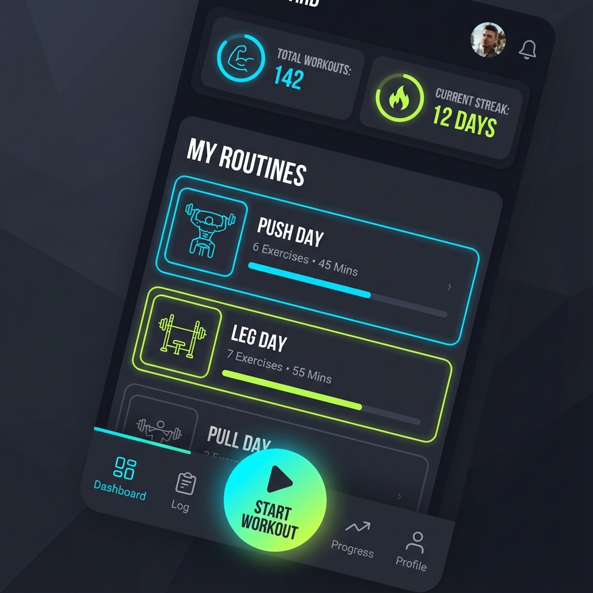
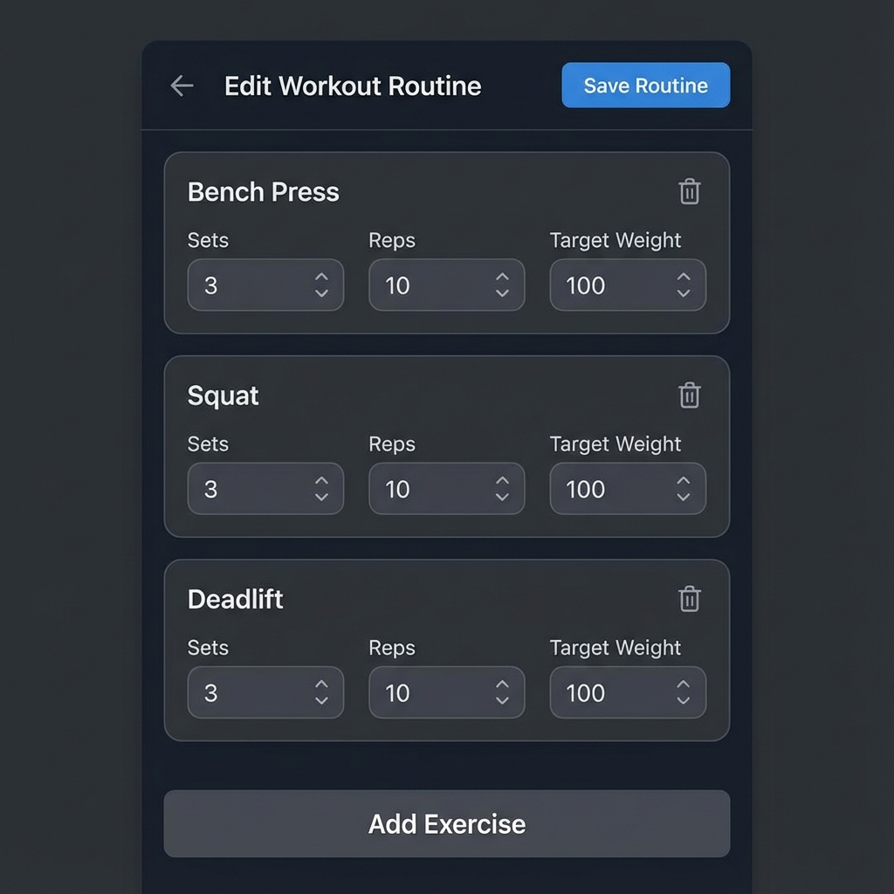
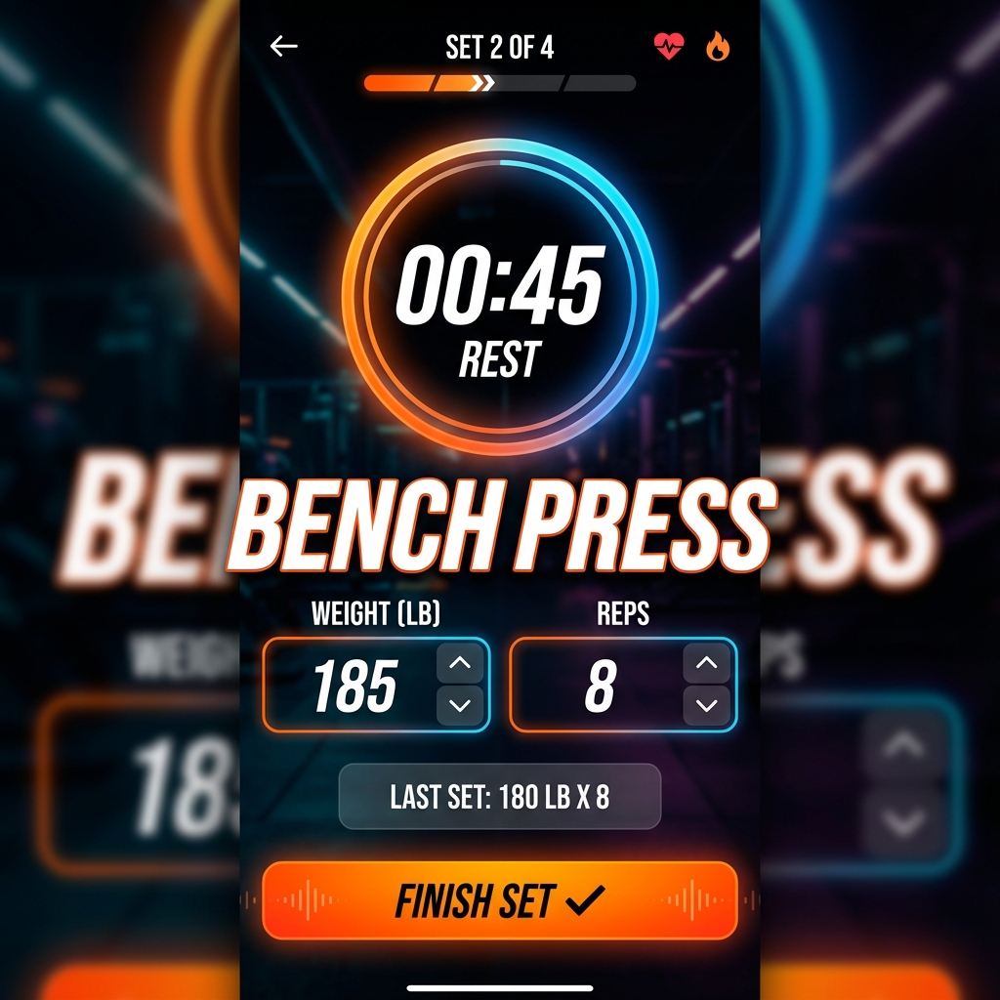

# Planejamento do Projeto: Gym App PWA

Este documento descreve o planejamento para o desenvolvimento de um aplicativo de academia focado no registro de exercícios e pesos, funcionando como uma PWA (Progressive Web App).

## 1. Visão Geral
O objetivo é criar uma aplicação front-end em Angular com PrimeNG que permita ao usuário criar sequências de exercícios (agrupamentos por dia) e executá-las, registrando cargas e controlando o tempo de descanso.

## 2. Design e Interface (Mockups)
Como primeiro passo, foram gerados mockups para as principais telas utilizando "Nano Banana" (Image Generation AI).

### Dashboard
Tela inicial com acesso rápido às rotinas e histórico.


### Editor de Sequências
Interface para criar e editar agrupamentos de exercícios (ex: "Treino A", "Costas e Bíceps").


### Tela de Execução
Modo focado no treino, com cronômetro de descanso e input de carga para cada série.


## 3. Funcionalidades Detalhadas

### 3.1. Dashboard
- **Visualização**: Lista de agrupamentos (sequências) disponíveis.
- **Ações**:
    - Botão para editar agrupamentos.
    - Selecionar um agrupamento para iniciar o treino.
    - Exibir resumo ou evolução (histórico de execuções).

### 3.2. Cadastro de Agrupamentos (Editor)
- **Funcionalidade**: Criar/Editar um agrupamento (ex: "Segunda-feira" ou "Peito").
- **Campos**:
    - Nome do Agrupamento.
    - Lista de Exercícios.
    - Para cada exercício: Nome, Número de Séries (Repetições), Peso inicial sugerido (opcional), Tempo de descanso sugerido.
- **Persistência**: Salvar no LocalStorage.

### 3.3. Execução do Treino
- **Interface**:
    - Destaque para o exercício atual.
    - **Cronômetro**: Grande e visível para contar o tempo de descanso entre séries (usa o tempo sugerido cadastrado).
    - **Registro de Carga**: Campos para inserir/editar o peso usado em cada repetição/série.
- **Fluxo**:
    - Usuário inicia o treino.
    - Seleciona exercício.
    - Realiza série -> Dispara cronômetro.
    - Registra peso.
    - Finaliza agrupamento -> Dados são salvos para consulta futura.

## 4. Arquitetura Técnica

- **Framework**: Angular (Latest).
- **UI Library**: PrimeNG (Componentes: Card, Button, InputText, Table/List, Dialog, Timer/Knob).
- **Estilização**: PrimeFlex ou CSS Grid/Flexbox moderno. Tema Escuro (Dark Mode) como padrão.
- **Persistência de Dados**: `localStorage` (ou `IndexedDB` via biblioteca caso necessário).
    - Estrutura JSON sugerida:
      ```json
      {
        "routines": [
          { "id": 1, "name": "Push Day", "exercises": [...] }
        ],
        "history": [
          { "date": "2023-10-27", "routineId": 1, "exercises": [...] }
        ]
      }
      ```
- **PWA**: Configuração de manifesto e Service Worker para instalar no celular.

## 5. Próximos Passos
1.  Configurar ambiente Angular + PrimeNG.
2.  Implementar Serviços de Storage (`GymService`).
3.  Desenvolver tela de Dashboard.
4.  Desenvolver Editor de Sequências.
5.  Desenvolver Modo de Execução.
